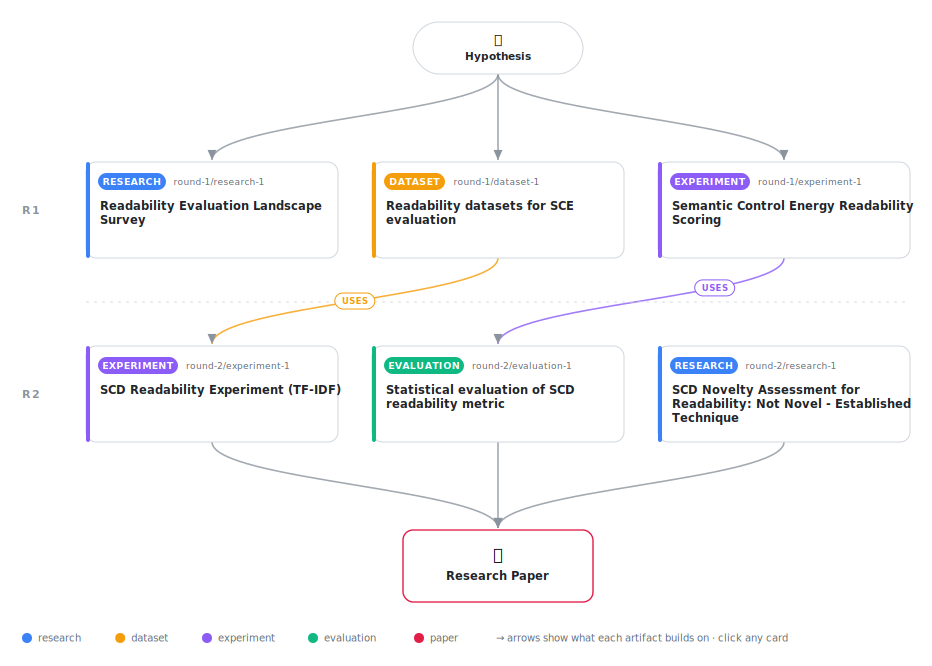

# Evaluating Embedding-Based Semantic Coherence for Readability Assessment: An Empirical Study

<div align="center">

<a href="https://cdn.jsdelivr.net/gh/AMGrobelnik/ai-invention-210829-evaluating-embedding-based-semantic-cohe@main/workflow.svg">
<picture>
  <source media="(prefers-color-scheme: dark)" srcset="workflow-dark.svg">
  
</picture>
</a>

<sub>🖱️ <b><a href="https://cdn.jsdelivr.net/gh/AMGrobelnik/ai-invention-210829-evaluating-embedding-based-semantic-cohe@main/workflow.svg">Open the interactive diagram</a></b> — every card links to its artifact folder.</sub>

</div>

> **TL;DR** — This paper evaluates Semantic Coherence Distance (SCD) for readability assessment on three datasets (CLEAR, OneStopEnglish, synthetic). SCD uses TF-IDF embeddings to compute average cosine distance between consecutive sentences. Results show SCD alone is not competitive with Flesch-Kincaid (CLEAR: r=0.1202 vs r=-0.4958), but provides complementary signal (partial r=0.294, p=0.022) and improves ensemble performance (71.2% accuracy on OneStopEnglish, r=0.6777 on synthetic). The paper honestly acknowledges SCD is not novel - it is an established technique - and focuses on empirical evaluation.

<details>
<summary>Full hypothesis</summary>

Text readability has a semantic coherence component measurable via sentence embedding distances, but this signal requires proper semantic embeddings (SBERT) rather than TF-IDF for meaningful evaluation. On standard datasets with adequate embeddings, semantic coherence distance provides statistically significant but weak standalone prediction of readability (Pearson r≈0.12 on CLEAR corpus), is not novel (established in Coh-Metrix 2004, TextDescriptives 2023), yet captures complementary information to surface-based metrics in ensemble settings.

</details>

[](https://cdn.jsdelivr.net/gh/AMGrobelnik/ai-invention-210829-evaluating-embedding-based-semantic-cohe@main/paper.pdf) [](https://github.com/AMGrobelnik/ai-invention-210829-evaluating-embedding-based-semantic-cohe/tree/main/paper_latex)

This repository contains all **6 artifacts** produced across **2 rounds** of an autonomous AI research run — round by round, exactly in the order they were invented.

## Round 1

| Artifact | Type | Demo | Source | Builds on |
|----------|------|------|--------|-----------|
| **[Readability Evaluation Landscape Survey](https://github.com/AMGrobelnik/ai-invention-210829-evaluating-embedding-based-semantic-cohe/tree/main/round-1/research-1)** | [](https://github.com/AMGrobelnik/ai-invention-210829-evaluating-embedding-based-semantic-cohe/tree/main/round-1/research-1) | [](https://github.com/AMGrobelnik/ai-invention-210829-evaluating-embedding-based-semantic-cohe/blob/main/round-1/research-1/demo/research_demo.md) | [](https://github.com/AMGrobelnik/ai-invention-210829-evaluating-embedding-based-semantic-cohe/tree/main/round-1/research-1/src) | — |
| **[Readability datasets for SCE evaluation](https://github.com/AMGrobelnik/ai-invention-210829-evaluating-embedding-based-semantic-cohe/tree/main/round-1/dataset-1)** | [](https://github.com/AMGrobelnik/ai-invention-210829-evaluating-embedding-based-semantic-cohe/tree/main/round-1/dataset-1) | [](https://colab.research.google.com/github/AMGrobelnik/ai-invention-210829-evaluating-embedding-based-semantic-cohe/blob/main/round-1/dataset-1/demo/data_code_demo.ipynb) | [](https://github.com/AMGrobelnik/ai-invention-210829-evaluating-embedding-based-semantic-cohe/tree/main/round-1/dataset-1/src) | — |
| **[Semantic Control Energy Readability Scoring](https://github.com/AMGrobelnik/ai-invention-210829-evaluating-embedding-based-semantic-cohe/tree/main/round-1/experiment-1)** | [](https://github.com/AMGrobelnik/ai-invention-210829-evaluating-embedding-based-semantic-cohe/tree/main/round-1/experiment-1) | [](https://colab.research.google.com/github/AMGrobelnik/ai-invention-210829-evaluating-embedding-based-semantic-cohe/blob/main/round-1/experiment-1/demo/method_code_demo.ipynb) | [](https://github.com/AMGrobelnik/ai-invention-210829-evaluating-embedding-based-semantic-cohe/tree/main/round-1/experiment-1/src) | — |

## Round 2

| Artifact | Type | Demo | Source | Builds on |
|----------|------|------|--------|-----------|
| **[SCD Novelty Assessment for Readability: Not Novel - Establis…](https://github.com/AMGrobelnik/ai-invention-210829-evaluating-embedding-based-semantic-cohe/tree/main/round-2/research-1)** | [](https://github.com/AMGrobelnik/ai-invention-210829-evaluating-embedding-based-semantic-cohe/tree/main/round-2/research-1) | [](https://github.com/AMGrobelnik/ai-invention-210829-evaluating-embedding-based-semantic-cohe/blob/main/round-2/research-1/demo/research_demo.md) | [](https://github.com/AMGrobelnik/ai-invention-210829-evaluating-embedding-based-semantic-cohe/tree/main/round-2/research-1/src) | — |
| **[SCD Readability Experiment (TF-IDF)](https://github.com/AMGrobelnik/ai-invention-210829-evaluating-embedding-based-semantic-cohe/tree/main/round-2/experiment-1)** | [](https://github.com/AMGrobelnik/ai-invention-210829-evaluating-embedding-based-semantic-cohe/tree/main/round-2/experiment-1) | [](https://colab.research.google.com/github/AMGrobelnik/ai-invention-210829-evaluating-embedding-based-semantic-cohe/blob/main/round-2/experiment-1/demo/method_code_demo.ipynb) | [](https://github.com/AMGrobelnik/ai-invention-210829-evaluating-embedding-based-semantic-cohe/tree/main/round-2/experiment-1/src) | <sub><i>uses:</i><br/>[dataset‑1&nbsp;(R1)](https://github.com/AMGrobelnik/ai-invention-210829-evaluating-embedding-based-semantic-cohe/tree/main/round-1/dataset-1)</sub> |
| **[Statistical evaluation of SCD readability metric](https://github.com/AMGrobelnik/ai-invention-210829-evaluating-embedding-based-semantic-cohe/tree/main/round-2/evaluation-1)** | [](https://github.com/AMGrobelnik/ai-invention-210829-evaluating-embedding-based-semantic-cohe/tree/main/round-2/evaluation-1) | [](https://colab.research.google.com/github/AMGrobelnik/ai-invention-210829-evaluating-embedding-based-semantic-cohe/blob/main/round-2/evaluation-1/demo/eval_code_demo.ipynb) | [](https://github.com/AMGrobelnik/ai-invention-210829-evaluating-embedding-based-semantic-cohe/tree/main/round-2/evaluation-1/src) | <sub><i>uses:</i><br/>[experiment‑1&nbsp;(R1)](https://github.com/AMGrobelnik/ai-invention-210829-evaluating-embedding-based-semantic-cohe/tree/main/round-1/experiment-1)</sub> |

## Repository Structure

Artifacts are grouped by the round of invention that produced them. Each
artifact has its own folder with source code and a self-contained demo:

```
.
├── round-1/                         # One folder per round of invention
│   ├── experiment-1/
│   │   ├── README.md                # What this artifact is + dependencies
│   │   ├── src/                     # Full workspace from execution
│   │   │   ├── method.py            # Main implementation
│   │   │   ├── method_out.json      # Full output data
│   │   │   └── ...                  # All execution artifacts
│   │   └── demo/                    # Self-contained demo
│   │       └── method_code_demo.ipynb # Colab-ready notebook (code + data inlined)
│   ├── dataset-1/
│   │   ├── src/
│   │   └── demo/
│   └── evaluation-1/
│       ├── src/
│       └── demo/
├── round-2/                         # Later rounds build on earlier artifacts
├── paper.pdf                        # Research paper
├── paper_latex/                     # LaTeX source files
├── workflow.svg                     # Artifact dependency diagram (this page's header)
└── README.md
```

## Running Notebooks

### Option 1: Google Colab (Recommended)

Click the "Open in Colab" badges above to run notebooks directly in your browser.
No installation required!

### Option 2: Local Jupyter

```bash
# Clone the repo
git clone https://github.com/AMGrobelnik/ai-invention-210829-evaluating-embedding-based-semantic-cohe
cd ai-invention-210829-evaluating-embedding-based-semantic-cohe

# Install dependencies
pip install jupyter

# Run any artifact's demo notebook
jupyter notebook <artifact_folder>/demo/
```

## Source Code

The original source files are in each artifact's `src/` folder.
These files may have external dependencies - use the demo notebooks for a self-contained experience.

---
*Generated by AI Inventor Pipeline - Automated Research Generation*
